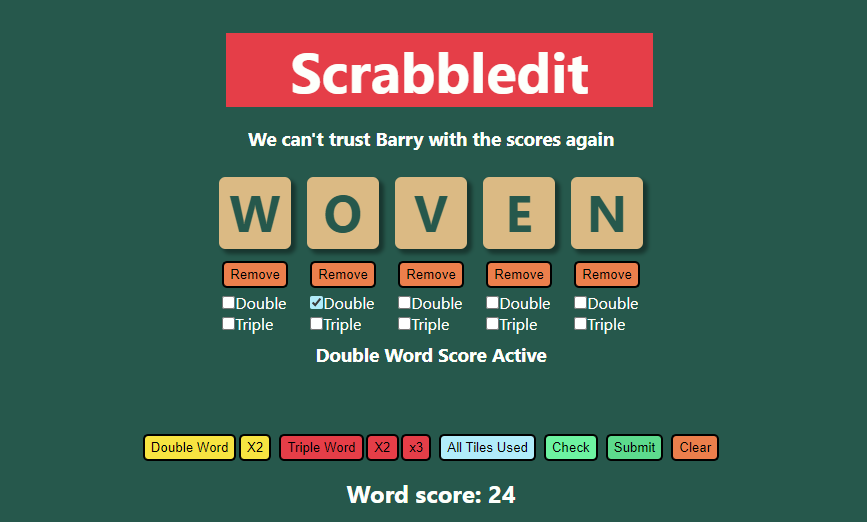
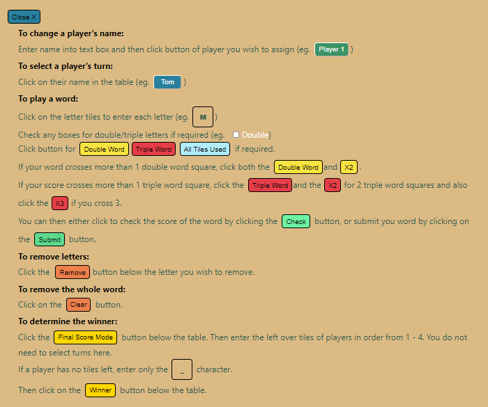

# SCRABBLEDIT

## Author
 Tom Birbeck [GitHub](https://github.com/TomBirbeck) / [LinkedIn](https://www.linkedin.com/in/tom-birbeck)

# Intro

An app that allows up to four players to input a scrabble word, check the score and then submit and track their scores for a full game. The app also has a built in final score mode where players can submit their left over tiles and a button to calculate the winner.

# How to use

The app comes with a full set of instructions on how to use it.

# How the app works

## Components:

#### App

Currently holds no states. This is where the title, motto and display are rendered and useContext is used to allow the whole app to access the word a player inputs.

#### Buttons

This component maps over an array of letters to produce a button that when clicked sets the word context, allowing the users input to be rendered on screen in the Display component.

#### Display

This is the main hub of the app. It contains the states and functions that track the multpliers used for letters and words. On clicking the 'Check' or 'Submit' buttons, the basic word is sent to the ScoreCalc component along with the double and triple letters, the score returned is then handed to the ScoreModeCalc function along with the word mode. This will then handle and score multiplications. Both of these functions are called inside the handleWordCheck and handleWordSubmit functions located in the Display component.
The word and score for that word is rendered in this component, as is the text to display any multiplier modes.
This component is also responsible for the removal of any letters or the complete clearing of a word
It also contains the states for the players, turns, final score mode and final tiles that all passed down for use in the Players component.

#### Instructions

On Click supplies a pop-up div that contains all the instructions on how to use the app.

#### Players

This component is responsible for rendering the scoreboard, which player's turn it currently is and calculating the winner using the handleWinner function.

#### ScoreCalc

This is a function that takes in the basic word, double letters and triple letters and calculates the score based on the scrabble letter point scoring system.

#### ScoreModeCalc

Tis is a function that takes a score and a word mode and will return the correct score for each word mode. 
